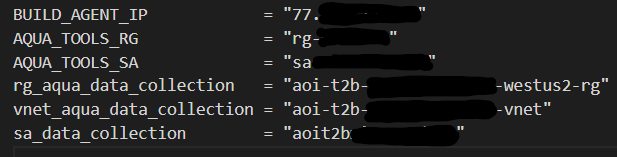

# **Azure Orbital - Infrastructure for Level 0 and Level 1 Processing of AQUA EOS Satellite Data**

# Contents

[Overview](#overview)

[Deployment](#deployment)

[Explore and Verify](#Explore-and-Verify)

[Example Output](#Example-Output)

[Backlog](#backlog)

# Overview

In this scenario we will be collecting raw instrument data from a NASA Earth Observation Satellite, AQUA. It is named Aqua, Latin for water, due to the large amount of information that the mission is collecting about the Earth's water cycle, including evaporation from the oceans, water vapor in the atmosphere, clouds, precipitation, soil moisture, sea ice, land ice, and snow cover on the land and ice. Additional variables also being measured by Aqua include radiative energy fluxes, aerosols, vegetation cover on the land, phytoplankton and dissolved organic matter in the oceans, and air, land, and water temperatures.

This Terraform deploys the downstream infrastructure components required to process raw instrument data from AQUA using the Azure Orbital Ground Station (AOGS). This builds on the Azure Orbital Integraton TCP to Blob Component to provide the self-start capability to build the infrastructure required to receive data from the ground station and process across virtual machine compute capability.

It is assumed that you have already registered the AQUA Spacecraft:

* Register a Spacecraft [documentation](https://learn.microsoft.com/en-us/azure/orbital/downlink-aqua#create--authorize-a-spacecraft-for-aqua)

You should be familiar with:

* Create a Contact Profile [documentation](https://docs.microsoft.com/en-us/azure/orbital/contact-profile)
* Schedule a Contact [documentation](https://docs.microsoft.com/en-us/azure/orbital/schedule-contact)

NASA's Earth Observing System Data and Information System (EOSDIS) data products are processed at various levels ranging from Level 0 to Level 4. Level 0 products are raw data at full instrument resolution. At higher levels, the data are converted into more useful parameters and formats.

Some useful documentation:

Azure Orbital [documentation](https://docs.microsoft.com/en-us/azure/orbital/)  
NASA AQUA Mission [documentation](https://aqua.nasa.gov/)  
NASA Direct Readout Labratory [DRL] [documentation](https://directreadout.sci.gsfc.nasa.gov/)  
NASA Real-time Software Telemetry Processing System [RT-STPS] [documentation](https://directreadout.sci.gsfc.nasa.gov/?id=dspContent&cid=69)  
NASA International Planetary Observation Processing Package [IPOPP] [documentation](https://directreadout.sci.gsfc.nasa.gov/?id=dspContent&cid=68)  
NASA Data Processing Levels [documentation](https://www.earthdata.nasa.gov/engage/open-data-services-and-software/data-information-policy/data-levels#:~:text=Level%200%20products%20are%20raw,many%20have%20Level%204%20SDPs.)  
NORAD TRE Empemeris [documentation](https://aqua.nasa.gov/)  

# Deployment

Pre-requisites:

* TCP to BLOB is a kubernetes service that provides a TCP endpoint to receive Azure Orbital Ground Station (AOGS) satellite downlink data and persists it in Azure BLOB Storage. TCP to Blob can be deployed from here:

  TCP to Blob [documentation](https://github.com/Azure/azure-orbital-integration/tree/main/tcp-to-blob)

  NB: You may need to edit the aks.bicep file to change the vmSize and availbilityZones for the aksCluster depending on Regional SKU availability
      (...../azure-orbital-integration/tcp-to-blob/deploy/bicep/aks.bicep).

* Clone the repository:  

  `git clone https://github.com/mattweale/azure-orbital-aqua-infrastructure.git` 

* Terraform uses a state file to manage the state of the resources deployed. In this deployment we will store the state file remotely, in Azure; specficically in a Storage Account Container called: tfstate. We first need to create those resources: 

  `# Create Resource Group` 
  `az group create -n <rg-name> -l uksouth` 
   
  `# Create Storage Account [Storage Account name needs to be globally unique]` 
  `az storage account create -n <sa-name> -g <rg-name> -l uksouth --sku Standard_LRS` 
   
  `# Create Storage Account Container` 
  `az storage container create -n tfstate --account-name <sa-name>`  

* The Backend Block tells Terraform where to store the state. This is where the .tfstate file will be stored. This block should contain the detals of the Resource Group, Storage Account and Container Name you have created. The Key is the name of the Blob, in the Container, that is the state file. Create a file called "azurerm.tfbackend" in /main and add your specific backend details like below: 
 

 

* Users must be registered with the NASA Direct Readout Labratory (DRL) in order to download the RT-STPS and IPOPP Software. These same credentials are also used by IPOPP to retrieve ancillaries from the DRL’s real-time and archived ancillary repositories during ingestion. You can register [here](https://directreadout.sci.gsfc.nasa.gov/) .  

* This deployment assumes that you have downloaded the required software from the NASA DRL and stored in a separate Storage Account with a Container for RT-STPS and IPOPP as below: 

  `https://[storageaccountname].blob.core.windows.net/rt-stps` 
  `/RT-STPS_7.0.tar.gz` 
  `/RT-STPS_7.0_testdata.tar.gz` 
   
 `https://[storageaccountname].blob.core.windows.net/ipopp` 
  `/DRL-IPOPP_4.1.tar.gz` 
  `/DRL-IPOPP_4.1_PATCH_1.tar.gz` 
  `/DRL-IPOPP_4.1_PATCH_2.tar.gz` 
   

* As we are running Terraform locally we will be authenticating using the Azure CLI:  

  `# Login to Azure and set Subscription` 
  `az login`  
  `az account set --subscription <subscription-id>`  
   
  `# Check Subscription` 
  `az account show`    

* We need to set some variables specific to your deployment of TCP to Blob and the location of the NASA Processing Software. We will use a variable definition file called .tvfars. Create a file called ".tfvars" in /main and add your details:  

  `# Your .tfvars file should look something like this` 
 

 

  `# .tfvars variable explanation` 
  `BUILD_AGENT_IP: IP Address from where Terraform is running to add to the Storage Account Firewall.`  
  `AQUA_TOOLS_RG: Resource Group that contains the Storage Account with the NASA DRL Tools.`  
  `AQUA_TOOLS_SA: Storage Account Containing the NASA DRL Tools.`  
  `rg_aqua_data_collection: Resource Group deployed by TCP to Blob. This deploys the additional resources for AQUA processing here.`  
  `vnet_aqua_data_collection: vNET deployed by TCP to Blob. This deploys the additional resources for AQUA processing into new Subnets in this vNET.`  
  `sa_data_collection: Storage Account deployed by TCP to Blob. This deploys an additional container here and creates a Managed Identity assigned to the VMs with RBAC access.`  
 

* Finally, apply the Terraform:  

  `# Initialise and apply the Terraform` 
    `cd main`  
    `terraform init -backend-config=azurerm.tfbackend`  
    `terraform plan -var-file=".tfvars"`  
    `terraform apply -var-file=".tfvars -auto-approve"`  
 

# Explore and Verify

Once deployed it should look like this:  
 
 

 
 

The TCP to Blob deployment will have already deployed the following resources:

* A vNET with:
  * vnet-subnet: Subnet for AKS Nodes.
  * pod-subnet: Subnet for AKS Pods.
  * orbital-subnet: Delegated Subnet for the Orbital Service.
* An Azure Container Registry.
* An AKS Cluster.
* A Storage Sccount and container for storing raw Orbital contact data.
* TCP to BLOB AKS service that listens for Orbital contact TCP connection and persists the TCP data to Azure BLOB storage.
* Orbital Contact profile configured with the appropriate endpoint and subnet for TCP to BLOB service.
* ADO Dashboard providing temporal view of TCP to BLOB activity and AKS cluster health.

Once this Terraform has subsequently been applied the following resources will also have been deployed:

2 Subnets:

* AzureBastionSubnet: Subnet for Bastion.
* aqua-tools-subnet: Subnet for hosting Virtual Machines for Aqua raw data processing.

2 Virtual Machines have been deployed into the aqua-tools-subnet each having been configured using a Custom Script Extension to download and execute scripts for post-deployment configuration and software installation of the components needed:

* vm-orbital-rt-stps - RT-STPS VM: The Real-time Software Telemetry Processing System [RT-STPS v7.0] ingests unsynchronized downlink data telemetry to various formats for further processing.
* vm-orbital-ipopp - International Planetary Observation Processing Package [IPOPP v4.1 Patch2] processes science data and derivative products [from AQUA and other missions] using Science Processing Algorithms [SPA]

* A Managed Identity is created and assigned access to the Storage Account that was created to store the NASA Software. This Managed Identity is attached to both the RT-STPS and IPOPP Virtual Machines that allows them to pull the software during the execution of Custom Script Extension.

* A Container (shared) is added to the Storage Account that was created by TCP to Blob.

* A Managed Identity is created and assigned access to the Storage Account that was created during the deployment of TCP to Blob. This Managed Identity is attached to both the RT-STPS and IPOPP Virtual Machines that allows them mount both Containers after deployment.

* A Storage Account is created and NFS mounted (/nfsdata) on both VMs as part of the deployment.

* An NSG attached to the aqua-tools-subnet with Inbound Traffic Allowed for 3389. Bastion should be used for SSH. Currently Bastion defaults to 32bit colour depth which is

Deployment takes approximately 45 minutes, the vast majority of this being the installation of IPOPP.

# Example Output

An example of the output that can be produced can be seen in the image below, a composite of a number of GEOTIFF's, displaying the Aqua Moderate Resolution Imaging Spectroradiometer (MODIS) NASA Level-2 (L2) Cloud Mask. The nominal spatial resolution of the Aqua MODIS L2 Cloud Mask is 1 km.
 
 

 
 

# Post Deployment Actions

A number of things that need to be done, or consider doing post deployment.

* A .netrc file containing NASA DRL credentials is required in the IPOPP user home directory.
* Use /etc/fstab to make /datadrive and /nfsdata persistent after reboot.
* Use blobuse2 to mount /raw-contact-data and /shared Containers [documentation](https://github.com/Azure/azure-storage-fuse).
* More elegant shell scripts all round :see_no_evil:
